  

<svg xmlns="http://w3.org" viewBox="0 0 1000 1100" width="100%" height="100%">
  <defs>
    <!-- গড-লেভেল নিয়ন গ্লো ফিল্টার ইফেক্ট -->
    <filter id="neon-glow" x="-20%" y="-20%" width="140%" height="140%">
      <feGaussianBlur stdDeviation="12" result="blur1" />
      <feGaussianBlur stdDeviation="25" result="blur2" />
      <feMerge>
        <feMergeNode in="blur2" />
        <feMergeNode in="blur1" />
        <feMergeNode in="SourceGraphic" />
      </feMerge>
    </filter>
    
    <!-- সায়ান টু ব্লু ওশান গ্রেডিয়েন্ট -->
    <linearGradient id="neon-gradient" x1="0%" y1="0%" x2="100%" y2="100%">
      <stop offset="0%" stop-color="#00f3ff" />
      <stop offset="50%" stop-color="#00a8ff" />
      <stop offset="100%" stop-color="#7000ff" />
    </linearGradient>
  </defs>

  <!-- গিটহাব ডার্ক মোড প্রিমিয়াম ক্যানভাস ব্যাকগ্রাউন্ড -->
  <rect width="100%" height="100%" fill="#0d1117" rx="20"/>
  
  <!-- ম্যাক স্টাইল টার্মিনাল ড্যাশবোর্ড হেডার -->
  <circle cx="45" cy="45" r="10" fill="#ff5f56"/>
  <circle cx="80" cy="45" r="10" fill="#ffbd2e"/>
  <circle cx="115" cy="45" r="10" fill="#27c93f"/>
  <text x="155" y="53" fill="#8b949e" font-family="Consolas, monospace" font-size="20" font-weight="bold">mofasel ~ network_profile.sh</text>
  <line x1="25" y1="85" x2="975" y2="85" stroke="#21262d" stroke-width="2"/>

  <!-- আপনার আসল নিখুঁত ফেস আর্টটিকে এখানে সরাসরি এম্বেড এবং নিয়ন ফিল্টার দেওয়া হলো -->
  <g filter="url(#neon-glow)">
    <!-- ইমেজ মাস্কিংয়ের মাধ্যমে সাদা অংশকে নিয়ন কালার এবং কালো অংশকে ডার্ক করার প্রো-ট্রিক -->
    <image href="ascii-face.png" x="125" y="120" width="750" height="750" style="mix-blend-mode: screen; opacity: 0.95; filter: drop-shadow(0px 0px 15px rgba(0, 243, 255, 0.6));" />
  </g>

  <!-- টার্মিনাল ফুটার (Whoami ড্যাশবোর্ড) -->
  <line x1="25" y1="960" x2="975" y2="960" stroke="#21262d" stroke-width="2"/>
  <text x="45" y="1015" fill="#8b949e" font-family="Consolas, monospace" font-size="24">
    <tspan fill="#58a6ff">mofasel@nstu</tspan><tspan fill="#ff79c6">:</tspan><tspan fill="#79c0ff">~</tspan><tspan fill="#ff79c6">$</tspan> whoami
  </text>
  <text x="45" y="1055" fill="#00f3ff" font-family="Consolas, monospace" font-size="22" font-weight="bold">
    &gt; [ STATUS ] ONLINE | MERN Stack Developer | Neural Network Active _
  </text>
</svg>
